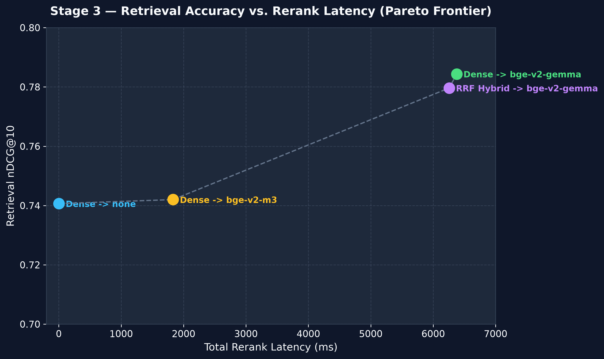
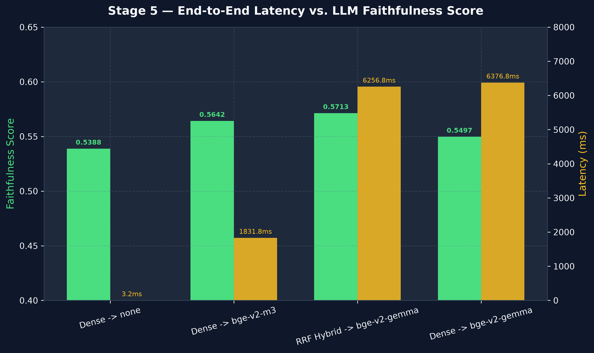
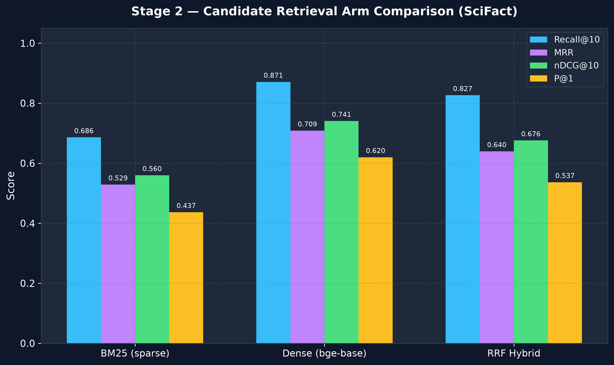
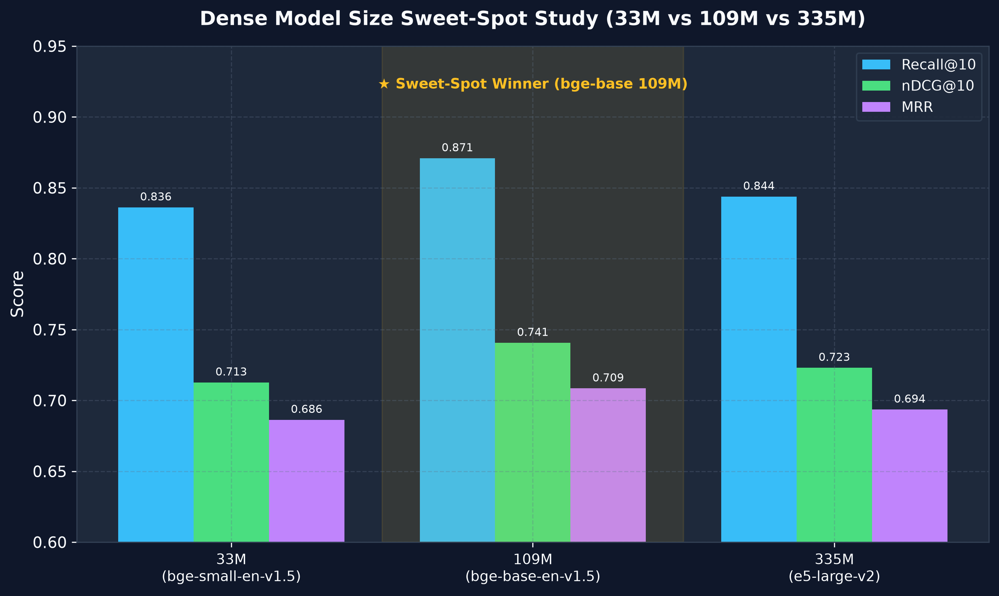

# End-to-End RAG Architecture with Built-in Retrieval & Evaluation Harness

[](https.python.org)
[-green.svg)](https://public.ukp.informatik.tu-darmstadt.de/thakur/BEIR/datasets/scifact.zip)
[-purple.svg)](https://huggingface.co/Qwen/Qwen2.5-7B-Instruct)
[](LICENSE)

An end-to-end Retrieval-Augmented Generation (RAG) system with a **built-in retrieval & evaluation harness**, benchmarked on the BEIR SciFact dataset (300 scientific queries, 5,183 peer-reviewed documents).

Unlike standard RAG setups that rely on external API calls, this repository implements **100% local, self-contained execution** — from sparse/dense FAISS indexing and 3x3 multi-model staged reranking to local citation-aware generation and a local 3-step Chain-of-Thought (CoT) LLM faithfulness judge.

---

## 🌟 Key Highlights & Master Pareto Results

Every configuration was evaluated on GPU across the 300 SciFact test queries. The **Phase 2 Pareto Frontier** identifies the non-dominated optimal choices balancing Retrieval Accuracy (nDCG@10), Rerank Latency (ms), and End-to-End Faithfulness:

| Candidate Retrieval Arm | Reranker Stage | Retrieval nDCG@10 | Rerank Latency (ms) | Faithfulness Score (`Qwen2.5-7B` Judge) | Key Takeaway |
| :--- | :--- | :---: | :---: | :---: | :--- |
| **Dense (`bge-base`)** | *None (Baseline)* | `0.7407` | **0.00 ms** | `0.5388` | Fast baseline, zero rerank overhead |
| **Dense (`bge-base`)** | **`bge-reranker-v2-m3`** | `0.7420` | **1,831.80 ms** | **`0.5642`** | ★ **Optimal Speed / Quality Sweet-Spot** |
| **RRF Hybrid ($k=60$)** | **`bge-reranker-v2-gemma`** | `0.7796` | **6,256.78 ms** | **`0.5713`** | ★ **Highest End-to-End Faithfulness** |
| **Dense (`bge-base`)** | **`bge-reranker-v2-gemma`** | **`0.7844`** | **6,376.81 ms** | `0.5497` | Maximum Retrieval nDCG@10 Peak |

<p align="center">
  
  
</p>

---

## 📊 Phase 1: Candidate Retrieval & Multi-Model Staged Reranking

### 1. Candidate Retrieval Arm Performance (Stage 2)
Evaluated across 300 test queries against ground-truth qrels:

| Arm | Retrieval Mechanism | Recall@10 | MRR | nDCG@10 | P@1 | Mean Latency (ms) |
| :--- | :--- | :---: | :---: | :---: | :---: | :---: |
| **BM25** | Lexical (`rank_bm25` BM25Okapi) | `0.6862` | `0.5288` | `0.5597` | `0.4367` | `20.28 ms` |
| **Dense** | Bi-Encoder (`BAAI/bge-base-en-v1.5` FAISS IndexFlatIP) | `0.8709` | `0.7085` | `0.7407` | `0.6200` | **`3.19 ms`** |
| **RRF Hybrid** | Reciprocal Rank Fusion ($k=60$, BM25 + Dense) | **`0.8267`** | `0.6395` | `0.6758` | `0.5367` | `23.54 ms` |

<p align="center">
  
</p>

### 2. Multi-Model 3x3 Staged Reranking Grid (Stage 3)
We evaluated a full $3 \times 3$ factorial grid combining all 3 candidate retrieval arms with 3 reranking strategies:
1. **None:** Baseline top-$k$ candidate ordering.
2. **BGE-M3 Reranker (`BAAI/bge-reranker-v2-m3` [367M]):** Cross-encoder champion.
3. **Gemma-2-2B Reranker (`BAAI/bge-reranker-v2-gemma` [2.5B]):** LLM decoder reranker champion.

*Key Finding:* Combining `bge-base` dense retrieval with the `bge-reranker-v2-gemma` decoder reranker elevated nDCG@10 from **`0.7407` to `0.7844` (+4.37% absolute improvement)**.

---

## 🔬 Phase 2: RAG Generation & LLM-as-a-Judge Evaluation

### 1. Citation-Aware Local Generation (`Qwen2.5-1.5B-Instruct`) (Stage 4)
* **Prompt Engineering:** Strict negative guardrails, 1-shot in-context learning, and inline document citation enforcement (`[Document doc_id]`).
* **Execution:** Generated 1,200 RAG answers (300 queries $\times$ 4 Pareto survivor configurations) with zero API costs.

### 2. Local Faithfulness LLM-as-a-Judge (`Qwen2.5-7B-Instruct`) (Stage 5)
* **Evaluation Rubric:** 3-step Chain-of-Thought (CoT) prompt executing atomic claim extraction and scientific entailment evaluation.
* **Result:** `RRF Hybrid -> Gemma Reranker` achieved the highest grounded factual faithfulness score (**`0.5713`**), while `Dense -> BGE-m3` achieved the best speed/quality balance (**`0.5642`** faithfulness at 3.3x faster rerank speed).

---

## 📐 Dense Model Size Sweet-Spot Benchmark

We evaluated whether larger embedding models improve domain retrieval on SciFact by benchmarking 3 model size tiers:

| Size Tier | Model | Parameters | Embedding Dim | Recall@10 | MRR | nDCG@10 | P@1 | Latency (ms) |
| :--- | :--- | :---: | :---: | :---: | :---: | :---: | :---: | :---: |
| **Small** | `BAAI/bge-small-en-v1.5` | 33M | 384 | `0.8362` | `0.6864` | `0.7127` | `0.6067` | **2.29 ms** |
| **Base ★** | **`BAAI/bge-base-en-v1.5`** | **109M** | **768** | **`0.8709`** | **`0.7085`** | **`0.7407`** | **`0.6200`** | `3.19 ms` |
| **Large** | `intfloat/e5-large-v2` | 335M | 1024 | `0.8438` | `0.6936` | `0.7230` | `0.6067` | `3.55 ms` |

<p align="center">
  
</p>

*Takeaway:* **Larger parameter size does not guarantee higher retrieval quality.** `bge-base` (109M) outperforms both `bge-small` (33M) and `e5-large-v2` (335M), establishing the optimal sweet-spot in accuracy, speed, and VRAM efficiency.

---

## 📂 Codebase Architecture

```
.
├── RAG_Setup.ipynb                    # Colab / Jupyter end-to-end execution notebook
│
├── src/                               # Modular Python Package
│   ├── engine/                        # Core reusable RAG modules
│   │   ├── common.py                  # Paths, constants, SciFact data loaders & chunkers
│   │   ├── metrics.py                 # Hand-written IR evaluation metrics & canary test
│   │   ├── rerankers.py               # Staged reranker models (BGE-m3 & Gemma-2B)
│   │   ├── generator.py               # Local Qwen2.5 RAG answer generator
│   │   └── judge.py                   # Local Qwen2.5-7B LLM-as-a-Judge faithfulness engine
│   │
│   ├── stages/                        # Executable pipeline stages (01 to 05)
│   │   ├── 01_index.py                # Stage 1: Build FAISS + BM25 indexes
│   │   ├── 02_retrieve.py             # Stage 2: Candidate retrieval (BM25, Dense, RRF)
│   │   ├── 03_rerank.py               # Stage 3: Multi-model staged reranking & Pareto grid
│   │   ├── 04_generate.py             # Stage 4: Local RAG answer generation on survivors
│   │   ├── 05_judge.py                # Stage 5: Faithfulness LLM judge evaluation
│   │   └── variants/                  # Secondary model size benchmark variants
│   │
│   └── verification/                  # Automated stage verification & sanity tests
│       ├── env_check.py               # Hardware & CUDA environment validator
│       ├── verify_stage1.py           # Stage 1 index cold-reload & cosine alignment harness
│       ├── verify_stage2.py           # Stage 2 retrieval metrics parity harness
│       ├── verify_stage3.py           # Stage 3 reranking & Pareto frontier harness
│       ├── verify_stage4.py           # Stage 4 answer generation harness
│       └── verify_stage5.py           # Stage 5 faithfulness judge harness
│
├── analysis/                          # Metrics Visualization & Plotting
│   ├── generate_plots.py              # Reproducible matplotlib chart generator
│   └── plots/                         # Generated high-resolution chart PNGs
│
├── notes/                             # Detailed Documentation & Execution Logs
│   ├── specs/                         # Stage architectural specifications
│   ├── logs/                          # Empirical execution logs & outputs
│   └── benchmarks/                    # Detailed model comparison studies
│
└── artifacts/                         # Persisted Index & Score Artifacts (gitignored)
    ├── index/                         # FAISS index files, BM25 pickles, & docmaps
    └── runs/                          # JSON evaluation runs & summary reports
```

---

## ⚡ Quickstart Guide

### 1. Installation

**Local Environment:**
```bash
git clone https://github.com/Gyan002-tech/End-to-End-RAG-Architecture-Evaluation-Harness.git
cd End-to-End-RAG-Architecture-Evaluation-Harness

# Create virtual environment
python3 -m venv .venv
source .venv/bin/activate

# Install dependencies
pip install -r requirements.txt
```

> [!TIP]
> **Running on Google Colab (T4 GPU):**
> PyTorch and CUDA are already pre-installed and aligned on Google Colab GPU runtimes. If running on Colab, use `requirements-colab.txt` to avoid overwriting Colab's pre-installed PyTorch build:
> ```bash
> !pip install -r requirements-colab.txt
> ```

### 2. Running Verification Suite
To verify pre-computed artifacts and score metrics without running heavy GPU inference:

```bash
# Run lightweight verification suite (~5 seconds)
python src/verification/verify_stage1.py
python src/verification/verify_stage2.py
python src/verification/verify_stage3.py
python src/verification/verify_stage4.py
python src/verification/verify_stage5.py
```

### 3. Re-generating Metric Plots
To update the visual plots in `analysis/plots/`:

```bash
python analysis/generate_plots.py
```

### 4. Running Full Pipeline (GPU Required)
To execute the end-to-end RAG harness from scratch:

```bash
# Stage 1: Build FAISS + BM25 indexes
python src/stages/01_index.py

# Stage 2: Candidate retrieval evaluation
python src/stages/02_retrieve.py

# Stage 3: Multi-model staged reranking
python src/stages/03_rerank.py

# Stage 4: Citation-aware answer generation
python src/stages/04_generate.py

# Stage 5: Local LLM faithfulness judge
python src/stages/05_judge.py
```

---

## 📜 Documentation

For full architectural breakdowns, mathematical formulas, and step-by-step logs, inspect the [`notes/`](notes/) directory:
* [Architectural Specifications](notes/specs/)
* [Empirical Stage Execution Logs](notes/logs/)
* [Benchmark Analyses](notes/benchmarks/)

---

## 📄 License

This project is licensed under the MIT License — see the [LICENSE](LICENSE) file for details.
